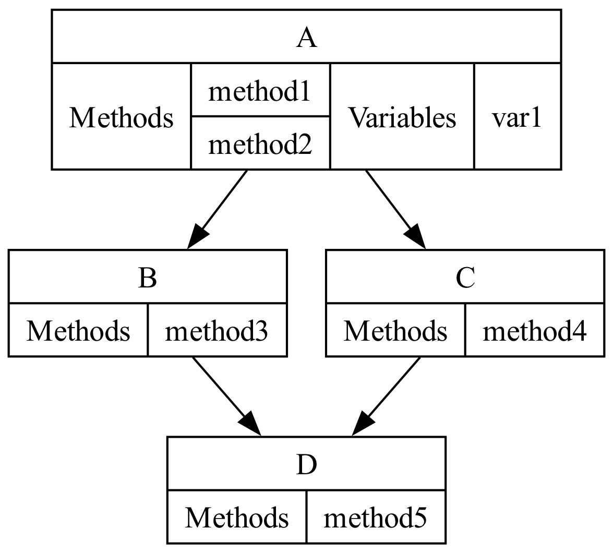

<center>

# 类层次结构可视化
*CHV(Class Hierarchy Visualizer)*
</center>

## 1. 简介
### 1.1. 功能
将python中的类输出为以图像形式展示的结构<br>

一个py文件示例:<br>
```python
class A:
    var1 = 10
    def method1(self):
        pass

    def method2(self):
        pass

class B(A):
    def method3(self):
        pass

class C(A):
    def method4(self):
        pass

class D(B, C):
    def method5(self):
        pass
```
<center>


*图1. 生成的结构图*<br>
</center>

### 1.2. 实现方案
* 通过python作为编程语言
* 通过AST进行源代码提取以实现程序解析的目的
* 通过以DOT语法进行结构的输出
* 通过Graphviz将结构转换为png图片(输出清晰度可调)

## 2. 文件夹内容
*文件夹内包含一组输出，以及相应的测试代码*<br>
* `main.py`: 主程序，包含默认的示例设置
* `python_file.py`: 测试文件，包含若干存在继承关系的类
* `img`: 存放图片
* `output`: 输出文件
    * `class_hierarchy.dot`: 根据类结构生成的dot描述文本
    * `class_hierarchy.png`: 通过描述文本输出的png图片

## 3. 环境
### 3.1. 安装Graphviz
此处只做简要叙述，详情参见官方说明<i>[Graphviz-Download](https://www.graphviz.org/download/)</i><br>

#### Windows
[graphviz-11.0.0 (32-bit) ZIP](https://gitlab.com/api/v4/projects/4207231/packages/generic/graphviz-releases/11.0.0/windows_10_msbuild_Release_graphviz-11.0.0-win32.zip)
[graphviz-11.0.0 (64-bit) ZIP](https://gitlab.com/api/v4/projects/4207231/packages/generic/graphviz-releases/11.0.0/windows_10_cmake_Release_Graphviz-11.0.0-win64.zip)
[graphviz-11.0.0 (32-bit) EXE](https://gitlab.com/api/v4/projects/4207231/packages/generic/graphviz-releases/11.0.0/windows_10_cmake_Release_graphviz-install-11.0.0-win32.exe)
[graphviz-11.0.0 (64-bit) EXE](https://gitlab.com/api/v4/projects/4207231/packages/generic/graphviz-releases/11.0.0/windows_10_cmake_Release_graphviz-install-11.0.0-win64.exe)

#### Linux
Ubuntu packages/Debian packages<br>
```bash
sudo apt install graphviz
```
Fedora project/CentOS systems<br>
```bash
sudo yum install graphviz
```
#### MacOS
[MacPorts](https://www.macports.org/)<br>
```bash
sudo apt install graphviz
```
[Homebrew](https://brew.sh/)<br>
```bash
sudo apt install graphviz
```

### 3.2. 配置python包环境
在终端运行如下命令<br>
```bash
pip install ast
pip install subprocess
```
## 4. 使用方法
### 调用

创建 CHV 类的实例，并调用 visualize 方法来生成类继承关系图<br>
```python
# 示例用法
file_path = 'python_file.py'  # 替换为你的Python文件路径

visualizer = CHV(file_path, output_dir="output", output_name="class_hierarchy", dpi=300)
visualizer.visualize()
```
**注意:** 类的构造中有三个具有默认值的参数,完全使用默认值参数时只需要将地址作为构造的唯一传入参数即可
* `output_dir`: **输出文件夹的地址**，默认为执行路径的同级目录，若目标为不存在的目录则会自动创建
* `output_name`: **输出文件的名称**，该名称会同时作用于`.dot`文件以及`.png`文件，默认名称为 *class_hierarchy*
* `dpi`: **输出图像的分辨率** ，默认值为*300*

### 图像显示

如果在Jupyter Notebook中运行，去掉最后的注释标志可以直接在IDE中显示生成的图片
```python
# 在Jupyter Notebook中显示图片
from IPython.display import Image
Image(filename=visualizer._png_filename)
```

## 5. TIPS
在VS Code中加入插件可以动态的进行`.dot`文件的快速实时预览
* [Graphviz (dot) language support for Visual Studio Code](https://marketplace.visualstudio.com/items?itemName=Stephanvs.dot): 提供dot相关语法支持
* [Graphviz Interactive Preview](https://marketplace.visualstudio.com/items?itemName=tintinweb.graphviz-interactive-preview): 提供实时的动态预览

## 附录

**CHV类类方法**<br>

* `__init__`: 初始化类的实例，接受文件路径、输出目录、输出文件名和图片清晰度（DPI）作为参数。
* `set_file_path`: 设置并验证文件路径。
* `set_output_dir`: 设置输出目录并在目录不存在时创建。
* `set_output_name`: 设置输出文件名并生成完整的文件路径。
* `set_dpi`: 设置并验证DPI值。
* `_analyze_file`: 解析指定的Python文件并提取类信息（私有方法）。
* `_analyze_code`: 辅助方法，用于解析源代码并返回类信息（私有方法）。
* `_generate_dot`: 生成Graphviz的DOT文件内容（私有方法）。
* `_save_dot_to_file`: 将DOT文件内容保存到文件中（私有方法）。
* `_convert_dot_to_png`: 将DOT文件转换为PNG图片（私有方法）。
* `visualize`: 执行所有步骤以生成类继承关系图。

**CHV._ClassDefVisitor 内部类**<br>

* 用于访问AST中的类定义，提取类名、基类、方法和变量。
* 该类仅在 CHV 内部使用，不对外部用户暴露。
